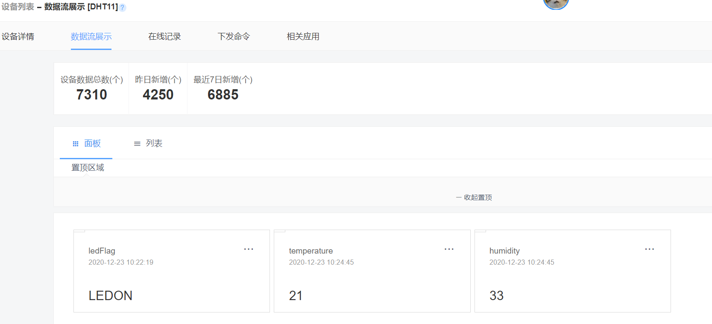
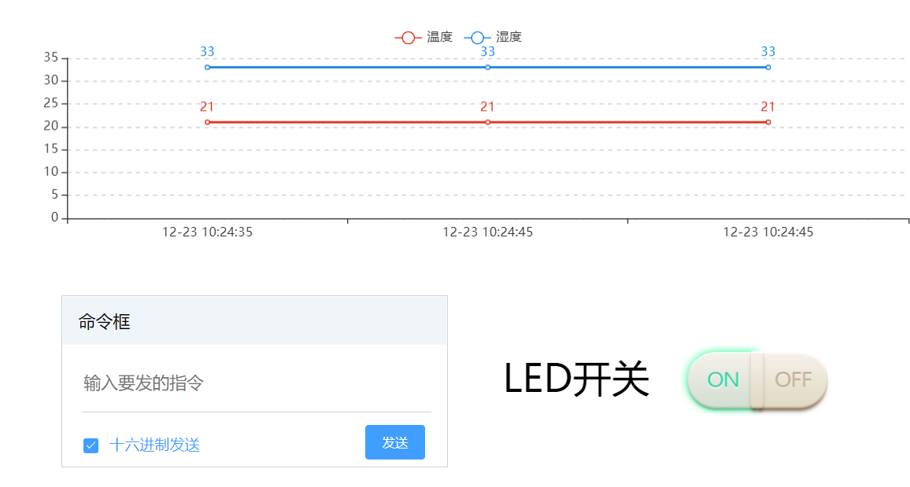
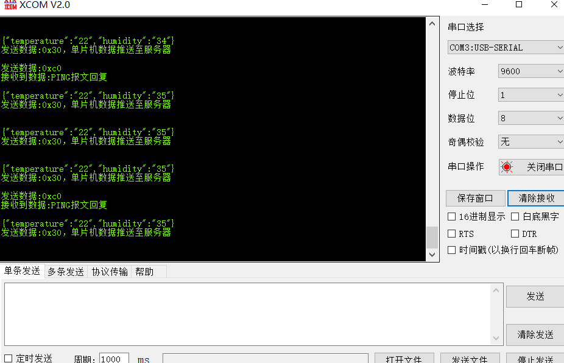
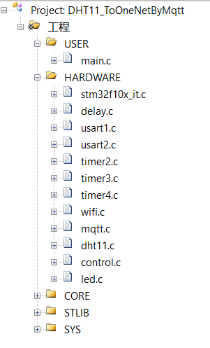
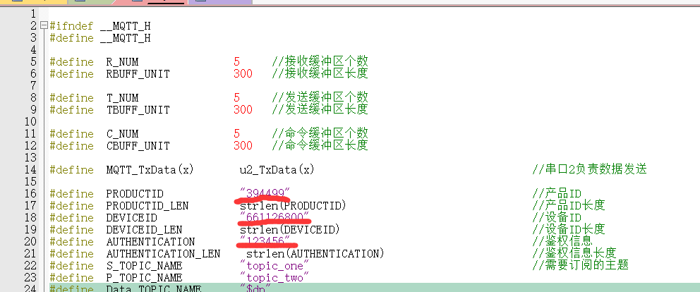
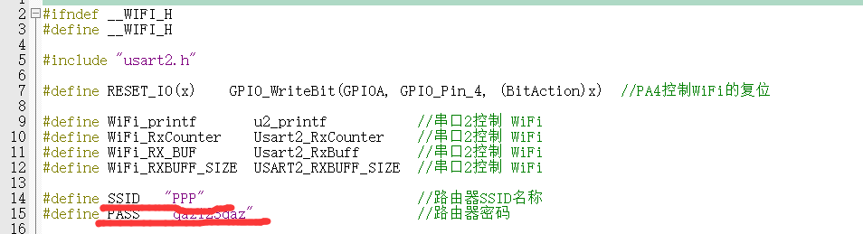
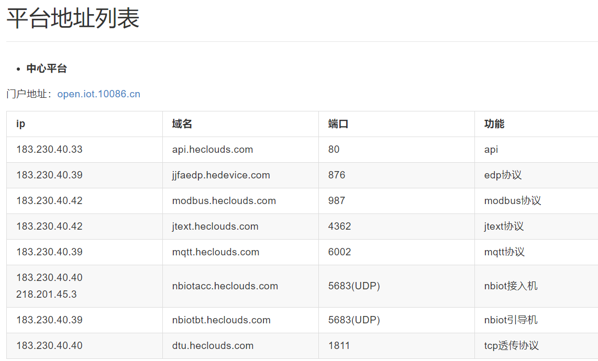
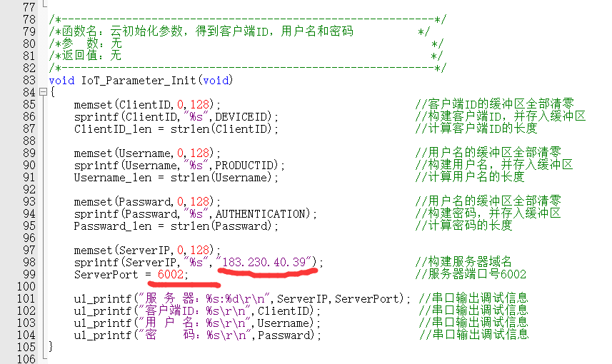

# ToOneNetByMqtt

**简介：** ESP8266通过MQTT协议将数据传输至OnenNet云平台

#### 1. 相关连接：

1. github（源码）： https://github.com/Mbwide/DHT11_ToOneNetByMqtt
2. CSDN：（图文解析）：https://blog.csdn.net/ssssadw/article/details/111584510
3. Bilibili（视频解析）：https://www.bilibili.com/video/BV1Vi4y1w7U1

#### 2. 具体功能：

1. SHT30采集环境温湿度数据，MQ7采集烟雾数据，光敏传感器采集光照数据，ESP8266模块通过MQTT协议将温湿度数据传输至OnenNet云平台
2.  OneNET可以通过云平台远程控制LED灯的亮灭
3.  串口显示相关数据信息

#### 3. 硬件环境：

1. 正点原子STM32F103RCT6（正点原子MiniSTM32）
2. SHT30温湿度传感器
3. MQ7烟雾传感器模块
4. 光敏传感器模块
5. ESP8266-01S无线模块

#### 4. 云平台环境配置：

1. **云平台配置：**
- OneNET控制台—全部产品服务（多协议接入，选MQTT旧版）—添加产品—进入产品（记住产品ID）—设备列表—添加设备（记住鉴权信息）—创建完成（记住设备ID）
  
2. **云平台应用设置：**
- 添加应用—编辑应用—组件库中添加折线图和开关
  
- 折线图（数据上传成功后进行配置）: 选择数据流 — 选择设备—数据流选择要显示的数据（这里选择温度，temperature）
   - 开关（数据上传成功后进行配置）: 选择数据流 — 选择设备—数据流选择要显示的数据（这里选择温度，ledFlag）—开关开值（LEDON）—开关关值（LEDOFF）——EDP不填

#### 5. 接线：

1. ESP8266-01S（5根线）

   - PA2     RX
   - PA3     TX
   - PB1    复位
   - 3V3     VCC
   - GND   GND

2.1 SHT30（4根线）
淘宝链接“https://item.taobao.com/item.htm?spm=a230r.1.14.30.357e2787HSoq79&id=624746490138&ns=1&abbucket=15#detail”

   - PB9   SDA 白

   - PB8  SCL 黄
 
   - 5V     VCC 红

   - GND   GND 黑
2.2 MQ7（4根线）
淘宝链接“https://detail.tmall.com/item.htm?id=17949567819&ali_refid=a3_430583_1006:1104520036:N:odzF1uI6rfPgpC/gCqRKfQ==:d4cf8d46a4c27414fb83e19cd5441114&ali_trackid=1_d4cf8d46a4c27414fb83e19cd5441114&spm=a230r.1.14.1”

   - PA4   AO

   - PA5   DO

   - 3.3V     VCC

   - GND   GND
2.1 LIGHT（4根线）
淘宝链接“https://detail.tmall.com/item.htm?spm=a230r.1.14.4.1c8175a4KeXVtK&id=20885572596&ns=1&abbucket=15”

   - PA6   AO

   - PA7   DO

   - 3.3V     VCC

   - GND   GND

3. LED（最小系统自带）
   - PC13    LED1

#### 6. 功能展示：

1. **数据流**

2. **APP应用管理**

   

3. **串口数据**

   

4. **源码简要解析**

   

   - stm32f10x_it.c：中断处理函数
   - usart1.c：与上位机通信
   - usart2.c：与ESP8266通信，串口2接收中断处理上位机发送来的数据
   - timer2.c：定时器2中断用来发送温湿度数据，10S
   - timer3.c：定时器3中断用来发送心跳包（ping，用于保持和服务器连接，长时间没给服务器发送数据会被踢下线），2s和30s两种模式
   - timer4.c：将串口2接收到的服务器数据依次存放在MQTT接收缓存数组中，50ms
   - control.c：控制LED灯，并且发送LED灯开关信号

#### 7. 要修改的的地方：

1. mqtt.h ：

   ```c
   #define  PRODUCTID      "412380"          //自己的产品ID
   #define  DEVICEID       "702197187"       //自己的设备ID 
   #define  AUTHENTICATION  "SHT30"         //自己的鉴权信息（创建设备的时候设置）
   ```
   
   
   
2. wifi.h

   ```c
    #define SSID   "Redmi K30 Ultra"                     //路由器SSID名称
    #define PASS   "stm32f407"               //路由器密码
   ```

   

3. mqtt.c

   ```c
   sprintf(ServerIP,"%s","183.230.40.39");              //构建服务器域名（ONENET的）
   ServerPort = 6002;                                   //服务器端口号6002
   ```
  sprintf(ServerIP,"%s","47.106.235.154/");              //构建服务器域名（自己的）
   ServerPort = 1883;                                   //服务器端口号1883


   根据平台地址列表填写，这里是mqtt协议

   

   

   

